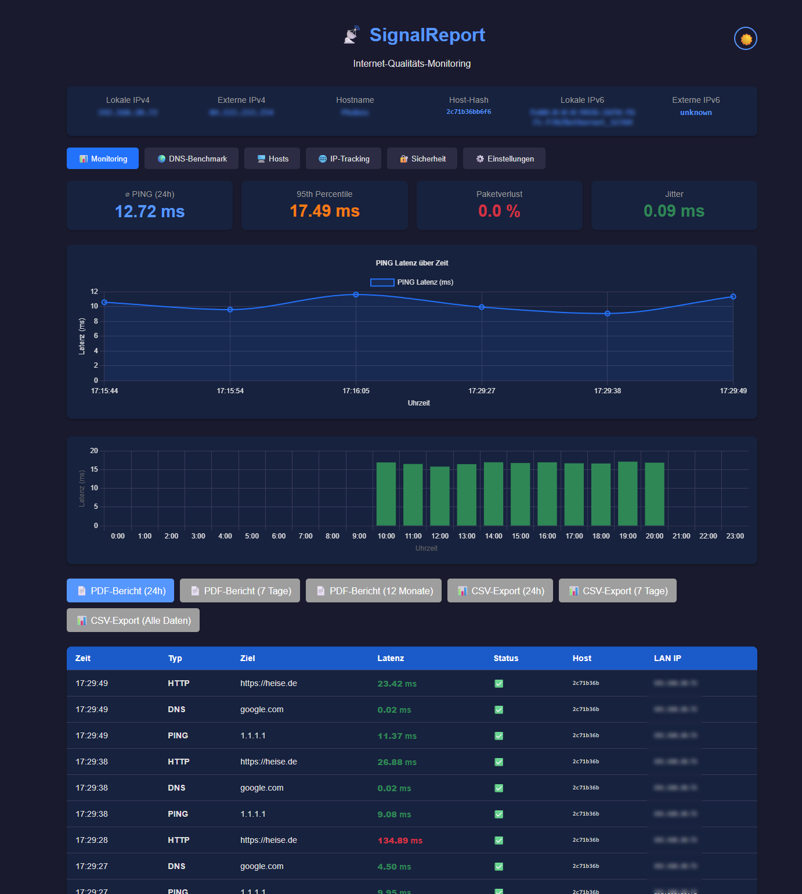
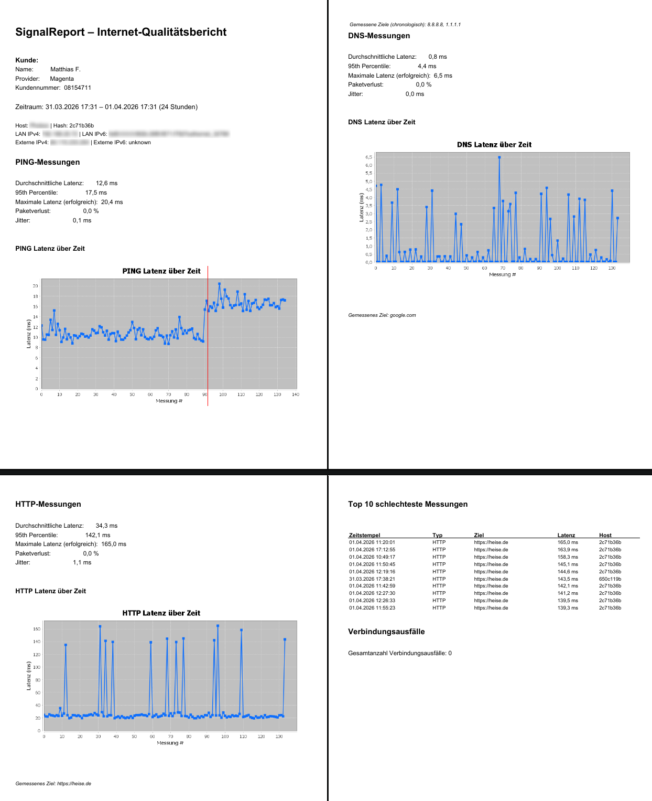
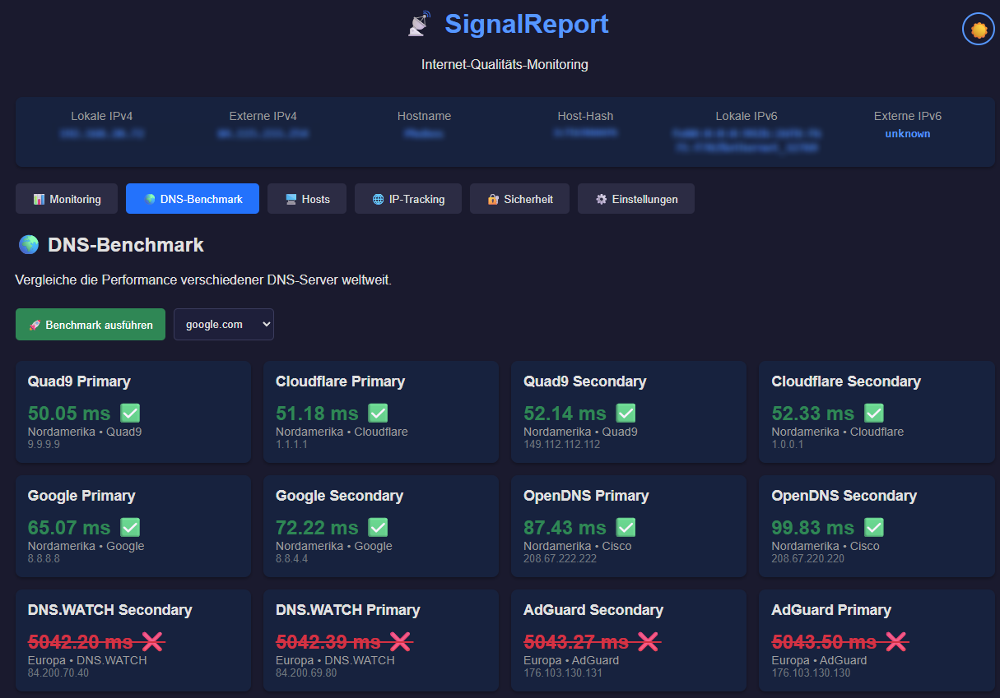

<p align="center">
  
</p>

<p align="center">
  <a href="https://openjdk.org/"></a>
  <a href="https://opensource.org/licenses/MIT"></a>
  <a href="https://junit.org/"></a>
</p>

Ein professionelles, Open-Source Monitoring-Tool zur kontinuierlichen Überwachung deiner Internet-Qualität – mit PDF-Berichten für Provider-Beschwerden, IP-Tracking und DNS-Benchmark.

> 💡 **Warum SignalReport?**  
> *"Mein Internet ist langsam!"* reicht bei Providern nicht. Mit SignalReport lieferst du **nachweisbare, quantifizierte Beweise** – nicht nur Bauchgefühl.

---

## 🌟 Features

| Kategorie | Funktionen |
|-----------|------------|
| **Monitoring** | 🔁 Kontinuierliche Messung (Ping/DNS/HTTP)<br>⏱️ Konfigurierbares Intervall (5s–1h)<br>⏸️ Maintenance-Fenster (Router-Updates)<br>🌐 IP-Tracking (externe IP-Änderungen erkennen) |
| **Visualisierung** | 📊 Live-Charts mit Chart.js<br>🌡️ Heatmap pro Stunde<br>🖥️ Web-Oberfläche (responsiv)<br>🔔 Browser-Push bei Ausfällen/Hoher Latenz |
| **Berichte** | 📄 PDF-Export (24h/7 Tage/12 Monate)<br>📈 3 Charts (PING/DNS/HTTP) mit Ziel-Änderungs-Markierung<br>🏆 Top 10 schlechteste Messungen<br>⚠️ Verbindungsausfall-Analyse<br>📤 CSV-Export (vollständig oder gefiltert) |
| **Sicherheit** | 🔐 Setup-Wizard (Web-basiert, keine CLI)<br>🔑 Optionale Authentifizierung (Basic Auth)<br>👥 Admin/User-Rollen |
| **Konfiguration** | ⚙️ Dynamische Messziele (Ping/DNS/HTTP)<br>🌍 DNS-Benchmark (Server weltweit)<br>👤 Benutzer-Info (Provider/Kundennummer für Berichte) |

---

## 🚀 Schnellstart

### Voraussetzungen
- Java 21 oder höher ([Download](https://adoptium.net/))
- (Optional) Maven für Build aus Quelle

### Installation & Start
```bash
# 1. JAR herunterladen (oder mit Maven bauen: mvn clean package)
java -jar signalreport.jar

# 2. Browser öffnen
http://localhost:4567

# 3. Setup-Wizard durchlaufen (Admin-Passwort festlegen)
```

✅ **Fertig!** Die Messung beginnt automatisch – alle 10 Sekunden werden Ping, DNS und HTTP getestet.

---

## 📸 Screenshots

| Web-Oberfläche | PDF-Bericht (Auszug) | DNS-Benchmark |
|----------------|----------------------|---------------|
|  |  |  |
| *Live-Charts, Statistiken, Einstellungen* | *Professioneller Bericht für Provider* | *Vergleich globaler DNS-Server* |

---

## ⚙️ Konfiguration

Nach dem ersten Start wird `config.json` erstellt. Wichtige Einstellungen:

```json
{
  "measurement": {
    "intervalSeconds": 10,
    "targets": {
      "ping": "8.8.8.8",
      "dns": "google.com",
      "http": "https://example.com"
    }
  },
  "maintenanceWindow": {
    "enabled": true,
    "startHour": 4,
    "startMinute": 0,
    "endHour": 4,
    "endMinute": 10
  },
  "userInfo": {
    "provider": "Oranga",
    "customerId": "08154711",
    "userName": "Matthias F."
  }
}
```

💡 **Tipp**: Änderungen über die Web-Oberfläche (Tab *⚙️ Einstellungen*) werden sofort übernommen und persistiert!

---

## 📊 PDF-Bericht – Perfekt für Provider-Beschwerden

Der 12-Monats-Bericht enthält:
- ✅ Deine Kundendaten (Name, Provider, Kundennummer)
- ✅ Host-Informationen (Hostname, Hash, IPs)
- ✅ 3 Charts mit roten Linien bei Ziel-Änderungen
- ✅ Chronologische Liste der gemessenen Ziele
- ✅ Top 10 schlechteste Messungen (mit Zeitstempel)
- ✅ Top 10 längste Verbindungsausfälle
- ✅ Gesamtanzahl der Ausfälle

> 📌 **So nutzt du den Bericht**:  
> 1. PDF mit "📄 PDF-Bericht (12 Monate)" generieren  
> 2. Als `signalreport-providername-beschwerde-2026-03-25.pdf` speichern  
> 3. An Support-Mail anhängen mit Text:  
> *"Anbei der technische Nachweis für wiederholte Verbindungsprobleme im Zeitraum XX bis YY. Bitte prüfen Sie die Leitung zu meinem Anschluss."*

---

## 🏗️ Projektstruktur

```
signalreport/
├── src/main/java/at/mafue/signalreport/
│   ├── SignalReportApp.java              # Hauptklasse (Entry Point)
│   ├── Config.java                       # Singleton-Konfiguration (JSON)
│   ├── Measurer.java                     # Interface (Strategy-Pattern)
│   ├── PingMeasurer.java                 # ICMP-Ping-Messung
│   ├── DnsMeasurer.java                  # DNS-Auflösungs-Messung
│   ├── HttpMeasurer.java                 # HTTP-GET-Messung
│   ├── DnsBenchmark.java                 # DNS-Server-Vergleich
│   ├── H2MeasurementRepository.java      # Datenbank-Zugriff (H2)
│   ├── WebServer.java                    # Javalin REST-API + Routing
│   ├── HtmlPageRenderer.java             # HTML-Rendering Hauptseite
│   ├── SetupPageRenderer.java            # HTML-Rendering Setup-Wizard
│   ├── PdfReportGenerator.java           # PDF-Export (OpenPDF + JFreeChart)
│   ├── NetworkInfo.java                  # IP-Adress-Ermittlung (mit Cache)
│   └── HostIdentifier.java              # Host-Hash (stabile ID)
├── src/test/java/at/mafue/signalreport/ # 7 Testklassen, 59 Tests
├── src/main/resources/web/               # Statische Dateien (Logos, Favicons)
├── docs/
│   ├── diagrams/                         # PlantUML-Diagramme (.puml + .png)
│   ├── latex/                            # Vollständige LaTeX-Dokumentation
│   └── screenshots/                      # UI-Screenshots
├── deployment/                           # Installations-Skripte (Win/Linux/macOS)
├── config.json                           # Auto-generierte Konfiguration
├── data/                                 # H2-Datenbank (gitignored)
├── pom.xml                               # Maven-Build-Konfiguration
└── README.md                             # Diese Datei
```

---

## 📚 Dokumentation

- **Vollständige LaTeX-Dokumentation**: `docs/latex/signalreport-dokumentation.pdf`  
  Enthält UML-Diagramme, Architekturbeschreibung, Implementierungsdetails und Testbericht.
- **UML-Diagramme**: Alle 7 Diagramme als PNG in `docs/diagrams/`:
  - `class-diagram.png` – Klassenstruktur
  - `component-diagram.png` – Komponentenübersicht
  - `sequence-measurement.png` – Messungsablauf
  - `sequence-pdf.png` – PDF-Export-Prozess
  - `usecase-diagram.png` – Use-Cases
  - `deployment-diagram.png` – Deployment-Szenarien
  - `state-diagram-auth.png` – Authentifizierungs-Zustände

---

## 🔒 Sicherheitshinweise

- **Authentifizierung**: Für öffentliche IPs (z.B. NAS mit Port-Weiterleitung) **unbedingt aktivieren** (Tab *🔐 Sicherheit*)
- **Setup-Passwort**: Admin-Passwort wird beim ersten Start festgelegt – niemals Standardwerte belassen!
- **Datenbank**: Alle Daten lokal gespeichert – keine Cloud-Abhängigkeit, keine externen APIs (außer ipify.org für externe IP)

---

## 🤝 Mitwirken

SignalReport ist Open Source! Du kannst:
- 🐛 Fehler melden (Issues)
- 💡 Neue Features vorschlagen
- 📝 Dokumentation verbessern
- 🌍 Übersetzungen beisteuern

---

## 📜 Lizenz

MIT License – siehe [LICENSE](LICENSE) Datei.  
*Frei nutzbar für private und kommerzielle Zwecke – mit Quellenangabe.*

---

## 🙏 Danksagung

Dieses Projekt nutzt großartige Open-Source-Bibliotheken und Dienste:

**Backend-Bibliotheken (Maven/Java):**
- [Javalin](https://javalin.io/) – Leichtgewichtiges Web-Framework
- [H2 Database](https://www.h2database.com/) – Embedded SQL-Datenbank
- [Jackson](https://github.com/FasterXML/jackson) – JSON-Serialisierung (Config, API)
- [OpenPDF](https://github.com/LibrePDF/OpenPDF) – PDF-Erstellung
- [JFreeChart](https://www.jfree.org/jfreechart/) – Chart-Generierung für PDF-Reports
- [dnsjava](https://dnsjava.org/) – DNS-Queries für Benchmark
- [SLF4J](https://www.slf4j.org/) + [Logback](https://logback.qos.ch/) – Logging
- [JUnit 5](https://junit.org/junit5/) – Test-Framework

**Frontend (Browser):**
- [Chart.js](https://www.chartjs.org/) – Live-Charts im Web-Interface (via CDN)

**Externe Dienste:**
- [ipify.org](https://www.ipify.org/) – Ermittlung der externen IP-Adresse

**Build & Deployment:**
- [Apache Maven](https://maven.apache.org/) – Build-System
- [Apache Commons Daemon](https://commons.apache.org/proper/commons-daemon/) – Service-Installation (procrun/jsvc)

**Dokumentation & Entwicklung:**
- [PlantUML](https://plantuml.com/) – UML-Diagramme
- [LaTeX](https://www.latex-project.org/) – Projektdokumentation
- [EmojiTerra](https://emojiterra.com/) – Emoji-Übersicht
- [StackOverflow](https://stackoverflow.com/) – Fragen/Antworten-Plattform für Softwareentwickler
- [Hitchhiker’s Guide to PlantUML](https://crashedmind.github.io/PlantUMLHitchhikersGuide/) – Nomen est omen


---

## 📮 Kontakt & Support

Bei Fragen zur Abschlussarbeit oder technischen Details:  
📧 **  


---

> 🌐 **SignalReport**  
> *Entwickelt mit ❤️ für alle, die ihre Internet-Qualität nachweisen wollen.*